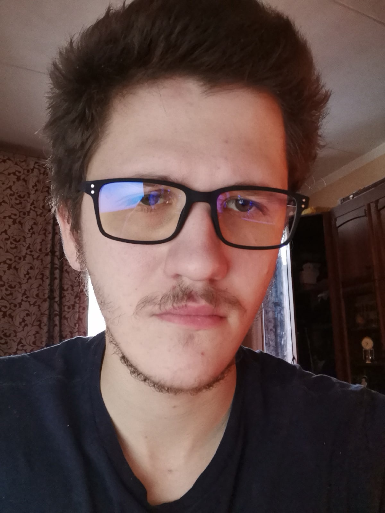

- [Contacts](#contacts)
- [Summary](#summary)
- [Skills](#skills)
- [Code](#code)
- [Courses](#courses)
- [Projects](#projects)
- [Education](#education)
- [Languages](#languages)

 
# **Konstantin Pykhtin**
## **My contacts**
- Adress: Russian Federation, Moscow
- Discord:Konstantin Py#5785
- E-mail: <k.pyhtin@gmail.com>
## **Summary**
After serving in the army, I decided to change my life for the better. I was fascinated by the idea of programming. Friends who already work in this field pushed me to this path.I am very grateful to them. Now I am discovering new horizons for myself and I am not going to stop. 
## **Skills**
- HTML5, CSS3
- JavaScript Basics
- Git, GitHub
- Vs code
## **Code**

`    `function multiply(a, b) {

`      `return a \* b;

`    `}

## **Courses**
- HTML and CSS Tutorials on the [code-basics](https://ru.code-basics.com/)(completed)
- JavaScript Manual on [learnjavascript.ru](https://learn.javascript.ru/)(in progress)
- RS Schools Course "JavaScript/Front-end.Stage O"(in progress)
## **Projects**
- [My first project](https://github.com/KonstantinPy/rsschool-cv)
## **Education**
- Graduate of School No. 1287 with Advanced Study of English 
- Incomplete higher education at the Medeleev University(3 courses) 
## **Languages**
- English-Intermediate(according to the online test at [www.efset.org](https://www.efset.org/)) 
- Russian-Native 

©2022 [Konstantin Pykhtin](https://github.com/KonstantinPy) 